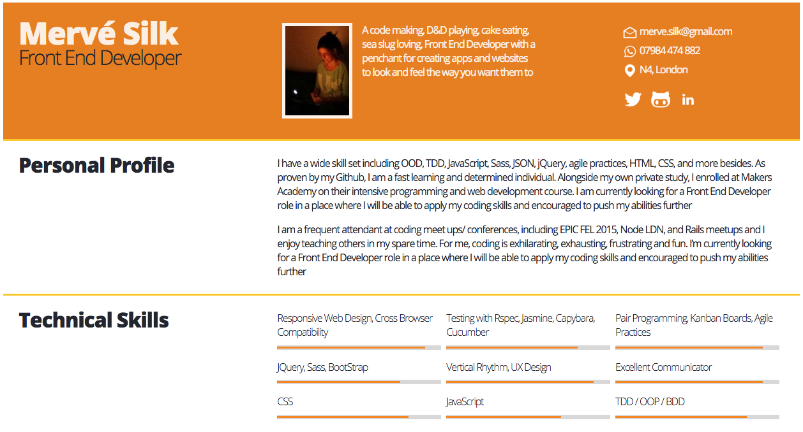

# A plethora of CV's...

To begin with, please enjoy the standard Developer Format (written in [Markdown]() naturally)

Prefer a [PDF]() version?

What about a CV displayed as a [JSON object]()?

How about my own creation of a single page [website]() instead?

Maybe you are after some project highlights first....

## Code examples

|[Thermostatic](https://github.com/Mervodactyl/thermostat_front_and_back)|[Blakey](https://github.com/Mervodactyl/blakey)| [ScssyDigimon](https://github.com/Mervodactyl/scssyDigimon)|
|--- |--- |--- |
| A Thermostat App built from scratch (front and back end) using Jasmine testing framework, vanilla JavaScript, JQuery, and CSS3/HTML | A Vertical Rhythm experiment explaining the importance of including the practice in Web Design, and  the commonalities it has with Jazz | Built in SCSS, JQuery and JSON; using various mixins, variables and formulas to make the site responsive and streamlined. Content is based on the attributes of Digimon characters |
| | ||
# cvDrafts
# cvDrafts
