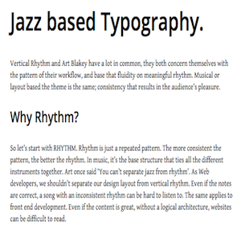
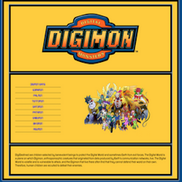

# Mervé Silk

__aka:__ A code making, D&D playing, cake eating, sea slug loving, Front End Developer with a penchant for creating apps and websites to look and feel the way you want them to.

## Web Development

I am a frequent attendant at coding meet ups/ conferences, including EPIC FEL 2015, Node LDN, and Code Bar. As proven by my Github, I am a fast learning and determined individual. My past experiences in planning engineering & project management mean I work well to deadlines and together in complex technical teams. Alongside my own private study, I took the initiative and enrolled at Makers Academy on their intensive programming and web development course. I have much relevant experience from this past year as a result of my tireless efforts. It has been exhilarating, exhausting, frustrating and fun.  I’m currently looking for a Front End Developer role in a place where I will be able to apply my coding skills and encouraged to push my abilities further.

### *Projects*
*Self developed exercises*

|[Thermostatic](https://github.com/Mervodactyl/thermostat_front_and_back)|[Blakey](https://github.com/Mervodactyl/blakey)| [ScssyDigimon](https://github.com/Mervodactyl/scssyDigimon)|
|--- |--- |--- |
| A Thermostat App built from scratch (front and back end) using Jasmine testing framework, vanilla JavaScript, JQuery, and CSS3/HTML | A Vertical Rhythm experiment explaining the importance of including the practice in Web Design, and  the commonalities it has with Jazz | Built in SCSS, JQuery and JSON; using various mixins, variables and formulas. The content is based around the attributes of Digimon |
| |||

### *Skill Set*
* TDD / OOP / BDD
* Pair Programming, Agile Practices
* Responsive Web Design, Cross Browser Compatibility
* Vertical Rhythm
* HTML5, CSS3, JavaScript, Ruby
* JQuery, Sass, BootStrap, ReactJS
* Testing with Rspec, Jasmine, Capybara, Cucumber
* SQL databases, JSON
* Continuous delivery with Git
* PhotoShop

* Creative
* Proactive
* Excellent Communicator
* Works well under pressure

## Experience

### [Freelance Front End Dev](https://github.com/Mervodactyl?tab=repositories)

_Oct 14 - Present_

* Create responsive sites aimed for various device usage
* Give consultancy advice to those who require assistance with either their websites and apps
* Design and build personal projects with the deliberate aim to expand and improve ones skill set
* Give talks to schools both primary and secondary with the aim to encourage young minds into technical fields
* Continued expansion and commitment to personal coding education

### [CritterCorder](https://www.behance.net/gallery/11111993/CritterCorder-Branding)

_Jan 13 - Mar 14_

**Project Manager**

* Lead meetings, make the final decision on project deadlines, deal with any major issues that occur
* Understand how to adapt to StartUp company requirements. Co- ordinate entire project and ensure the campaign runs smoothly
* Make the final decisions on all art related CritterCorder formats – Logo/ posters/ banners etc. Direct filming and editing of public videos
* Standard StartUp enviroment, required to be involed in all areas as and when needed

### [Amber Projects](http://www.amberprojects.co.uk/)

_April 12 - Sept 12_

**Planning Engineering Assistant**

* Use Primavera Oracle 6 Software to create and maintain Engineering Plans
* Update Programme and Progress reporting, verifying consistency with previous reports to facilitate compatibility
* Issue reports in support of the programmes reporting processes. Compiling, summarising, updating, and maintaining historical schedule data. Monitor and report on the critical path and schedule performance of the total project
* Monitor risks and opportunities, and consequently develop mitigating actions Prepare and or review schedule logic and duration changes in conjunction with the project team, to determine whether the schedules will adequately support the overall project schedule and comply with NEC contractual processes

### [Project Resource](http://www.project-resource.co.uk/)

_Jan 12 - Mar 12_

**Recruitment Consultant**

* Development of my own business area through proactive marketing drives, structured selling and networking techniques
* Management of the recruitment process from start to finish
* Development of the existing database by adding new job seekers that add value to the database and our clients’ needs
* Advertising of all job vacancies through various approved advertising mediums

### [Barnardo's Childrens Charity](http://www.barnardos.org.uk/)

_Feb 08 - May 08_

**Administrator & UK Co-ordinator**

* Promoted twice despite this being temp role (filing clerk -> receptionist -> head admin)
* Responsible for interregional stock management and creative dept admin needs (note taking, diary organisation, travel coordination etc)
* General Admin duties

### [Bart_Williams & Co. Solicitors](http://www.bwcsolicitors.co.uk/)

_Oct 08 - Jan 08_

**Receptionist**

* Responsible for the completion of ‘Last Will and Testaments’ along with other documents of importance
* Took the initiative to coordinate the company’s records into a more efficient system
* General Admin duties

### [French Woods Performing Arts Camp](http://frenchwoods.com/)

_Jun 07 - Aug 07_

**Creative Arts Teacher & Counsellor**

* Accountable for risk management whilst seeing to the development of practical Art techniques such as metal work, print screening, woodcraft etc
* Lead and teach up to 21 class members at any time
* Create a positive and creative learning environment for all ages

## Education
### Full Stack Graduate, [Makers Academy](http://www.makersacademy.com/) - ref. previous section

**Academy Student & Self Taught Development**

* Programming Bootcamp, Aug 14 - Sept 15
* Highly selective 12 week Web Development programme, with interview exam based entry
* Focused learning on best practices across the board including TDD and OOP, Front and Backend, agile formats
* Developed self reliance in the field of code
* Decided to fully commit to code and spent the last year developing new skill set and focusing on Front End Development - CSS3, HTML5, JavaScript etc
* Continued expansion and commitment to personal coding education

### BA, 2:1, [Royal Holloway](https://www.royalholloway.ac.uk/home.aspx) University of London

* Studied 'World History' Sept 08 - Jul 11
* Modules inc. The History of Terrorism, Plagerism and Original Thought, The Rise of Religion

### A-Levels/ AS/ GCSE's
* 5 AL, AS levels
* 9 A- C’s, extra language qualification in Turkish

## Interests
In my spare time you will find me writing readable, maintainable, tested code. You will also find me shamelessly feeding my book addiction, sketching on my art pad, mastering Wing Chun Kung Fu, or swinging from an Aerial hoop in Circus school. If given the tiniest opportunity, I will tell you why Digimon is superior to Pokémon.

## Contact Me
* [Email](merve.silk@gmail.com)
* [LinkedIn](https://www.linkedin.com/in/mervesilk)
* [GitHub](https://github.com/mervodactyl)
* [Twitter](http://twitter.com/mervodactyl)
